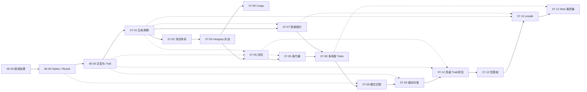

# Rust 学习笔记

Rust 知识点思维导图整理，按学习时间记录。

## 知识图谱

| 日期 | 知识点 | 文件 |
|------|--------|------|
| 2026-06-29 | 错误处理机制 | [思维导图](notes/xmind/错误处理机制.xmind) · [笔记](notes/md/Rust错误机制总结.md) |
| 2026-06-30 | Option / Result 方法 | [思维导图](notes/xmind/Option_Result方法.xmind) · [笔记](notes/md/RustOption与Result方法总结.md) |
| 2026-06-30 | 泛型与 Trait 工程实践 | [思维导图](notes/xmind/泛型与Trait工程实践.xmind) · [笔记](notes/md/Rust泛型与Trait工程实践总结.md) |
| 2026-07-01 | 生命周期 (Lifetime) | [思维导图](notes/xmind/生命周期.xmind) · [笔记](notes/md/Rust生命周期总结.md) |
| 2026-07-02 | 测试体系、cargo test | [思维导图](notes/xmind/测试体系与cargo_test.xmind) · [笔记](notes/md/Rust测试体系与cargo_test总结.md) |
| 2026-07-03 | 第12章 minigrep 项目 | [思维导图](notes/xmind/第12章minigrep项目.xmind) · [代码](projects/minigrep/) |
| 2026-07-05 | 闭包 (Closure) | [思维导图](notes/xmind/闭包.xmind) · [笔记](notes/md/Rust闭包总结.md) |
| 2026-07-05 | 迭代器 (Iterator) | [思维导图](notes/xmind/迭代器.xmind) · [笔记](notes/md/Rust迭代器总结.md) |
| 2026-07-06 | Cargo 知识体系 | [思维导图](notes/xmind/Cargo知识体系.xmind) · [笔记](notes/md/RustCargo知识体系总结.md) |
| 2026-07-07 | 智能指针 (所有权 / Deref / Drop) | [思维导图](notes/xmind/智能指针.xmind) · [笔记](notes/md/Rust智能指针总结.md) |
| 2026-07-08 | 多线程与 Tokio 并发 | [思维导图](notes/xmind/多线程与Tokio并发.xmind) · [笔记](notes/md/Rust多线程与Tokio并发总结.md) |
| 2026-07-09 | 模式匹配 (语法 / 场景 / 最佳实践) | [模式匹配.xmind](notes/xmind/模式匹配.xmind) |
| 2026-07-09 | 面向对象特性 | [面向对象特性.xmind](notes/xmind/面向对象特性.xmind) |
| 2026-07-12 | 高级 Trait 与高级闭包 | [Rust高级Trait与高级闭包.md](notes/md/Rust高级Trait与高级闭包.md) |
| 2026-07-12 | 宏基础 | [Rust宏基础总结.md](notes/md/Rust宏基础总结.md) |
| 2026-07-12 | unsafe 机制 | [Rust非安全机制总结.md](notes/md/Rust非安全机制总结.md) |
| 2026-07-12 | 简单 Web 服务器 | [笔记](notes/md/Rust简单Web服务器.md) · [代码](projects/web-server/) |
