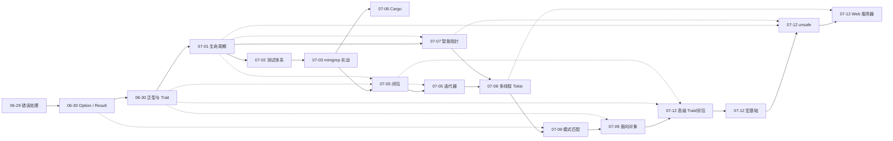

# Rust 学习笔记

Rust 知识点思维导图整理，按学习时间记录。

## 知识图谱

| 日期 | 知识点 | 文件 |
|------|--------|------|
| 2026-06-29 | 错误处理机制 | [rust_error_mechanism.xmind](notes/rust_error_mechanism.xmind) |
| 2026-06-30 | Option / Result 方法 | [rust_option_result_methods.xmind](notes/rust_option_result_methods.xmind) |
| 2026-06-30 | 泛型与 Trait 工程实践 | [rust_generics_and_trait_engineering_practice.xmind](notes/rust_generics_and_trait_engineering_practice.xmind) |
| 2026-07-01 | 生命周期 (Lifetime) | [rust_lifetime.xmind](notes/rust_lifetime.xmind) |
| 2026-07-02 | 测试体系、cargo test | [rust_testing_basics_cargo_test_engineering_practice.xmind](notes/rust_testing_basics_cargo_test_engineering_practice.xmind) |
| 2026-07-03 | 第12章 minigrep 项目 | [思维导图](notes/rust_chapter12_minigrep_project_summary.xmind) · [代码](projects/minigrep/) |
| 2026-07-05 | 闭包 (Closure) | [rust_closure_summary.xmind](notes/rust_closure_summary.xmind) |
| 2026-07-05 | 迭代器 (Iterator) | [rust_iterator_summary.xmind](notes/rust_iterator_summary.xmind) |
| 2026-07-06 | Cargo 知识体系 | [rust_cargo_summary.xmind](notes/rust_cargo_summary.xmind) |
| 2026-07-07 | 智能指针 (所有权 / Deref / Drop) | [rust_smart_pointers_ownership_deref_drop.xmind](notes/rust_smart_pointers_ownership_deref_drop.xmind) |
| 2026-07-08 | 多线程与 Tokio 并发 | [rust_multithreading_tokio_concurrency.xmind](notes/rust_multithreading_tokio_concurrency.xmind) |
| 2026-07-09 | 模式匹配 (语法 / 场景 / 最佳实践) | [rust_pattern_matching_syntax_scenarios_best_practices.xmind](notes/rust_pattern_matching_syntax_scenarios_best_practices.xmind) |
| 2026-07-09 | 面向对象特性 | [rust_oop_features_engineering_summary.xmind](notes/rust_oop_features_engineering_summary.xmind) |
| 2026-07-12 | 高级 Trait 与高级闭包 | [rust_advanced_trait_and_closure.md](notes/rust_advanced_trait_and_closure.md) |
| 2026-07-12 | 宏基础 | [rust_macro_basics_summary.md](notes/rust_macro_basics_summary.md) |
| 2026-07-12 | unsafe 机制 | [rust_unsafe_mechanism_summary.md](notes/rust_unsafe_mechanism_summary.md) |
| 2026-07-12 | 简单 Web 服务器 | [笔记](notes/rust_simple_web_server.md) · [代码](projects/web-server/) |
