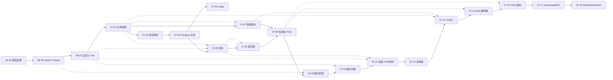

# Rust 学习笔记

Rust 知识点思维导图整理，按学习时间记录。

## 知识图谱

| 日期 | 知识点 | 文件 |
|------|--------|------|
| 2026-06-29 | 错误处理机制 | [思维导图](notes/xmind/rust_error_handling.xmind) · [笔记](notes/md/rust_error_handling.md) |
| 2026-06-30 | Option / Result 方法 | [思维导图](notes/xmind/rust_option_result.xmind) · [笔记](notes/md/rust_option_result.md) |
| 2026-06-30 | 泛型与 Trait 工程实践 | [思维导图](notes/xmind/rust_generics_trait.xmind) · [笔记](notes/md/rust_generics_trait.md) |
| 2026-07-01 | 生命周期 (Lifetime) | [思维导图](notes/xmind/rust_lifetime.xmind) · [笔记](notes/md/rust_lifetime.md) |
| 2026-07-02 | 测试体系、cargo test | [思维导图](notes/xmind/rust_testing_cargo_test.xmind) · [笔记](notes/md/rust_testing_cargo_test.md) |
| 2026-07-03 | 第12章 minigrep 项目 | [思维导图](notes/xmind/rust_minigrep.xmind) · [代码](projects/minigrep/) |
| 2026-07-05 | 闭包 (Closure) | [思维导图](notes/xmind/rust_closure.xmind) · [笔记](notes/md/rust_closure.md) |
| 2026-07-05 | 迭代器 (Iterator) | [思维导图](notes/xmind/rust_iterator.xmind) · [笔记](notes/md/rust_iterator.md) |
| 2026-07-06 | Cargo 知识体系 | [思维导图](notes/xmind/rust_cargo.xmind) · [笔记](notes/md/rust_cargo.md) |
| 2026-07-07 | 智能指针 (所有权 / Deref / Drop) | [思维导图](notes/xmind/rust_smart_pointers.xmind) · [笔记](notes/md/rust_smart_pointers.md) |
| 2026-07-08 | 多线程与 Tokio 并发 | [思维导图](notes/xmind/rust_multithreading_tokio.xmind) · [笔记](notes/md/rust_multithreading_tokio.md) |
| 2026-07-09 | 模式匹配 (语法 / 场景 / 最佳实践) | [思维导图](notes/xmind/rust_pattern_matching.xmind) · [笔记](notes/md/rust_pattern_matching.md) |
| 2026-07-09 | 面向对象特性 | [思维导图](notes/xmind/rust_oop.xmind) · [笔记](notes/md/rust_oop.md) |
| 2026-07-12 | 高级 Trait 与高级闭包 | [笔记](notes/md/rust_advanced_trait_closure.md) |
| 2026-07-12 | 宏基础 | [笔记](notes/md/rust_macros.md) |
| 2026-07-12 | unsafe 机制 | [笔记](notes/md/rust_unsafe.md) |
| 2026-07-12 | 简单 Web 服务器 | [笔记](notes/md/rust_web_server.md) · [代码](projects/web-server/) |
| 2026-07-16 | Tokio 架构 (Future / Waker / Executor) | [tokio_future_waker_executor.md](Tokio/tokio_future_waker_executor.md) |
| 2026-07-17 | Tokio async / await / Pin | [tokio_async_await_pin.md](Tokio/tokio_async_await_pin.md) |
| 2026-07-18 | Tokio Stream / join! / select! | [tokio_stream_join_select.md](Tokio/tokio_stream_join_select.md) |
