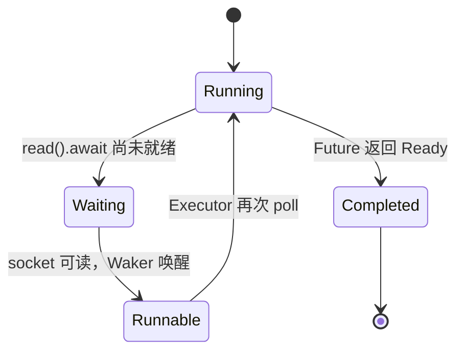
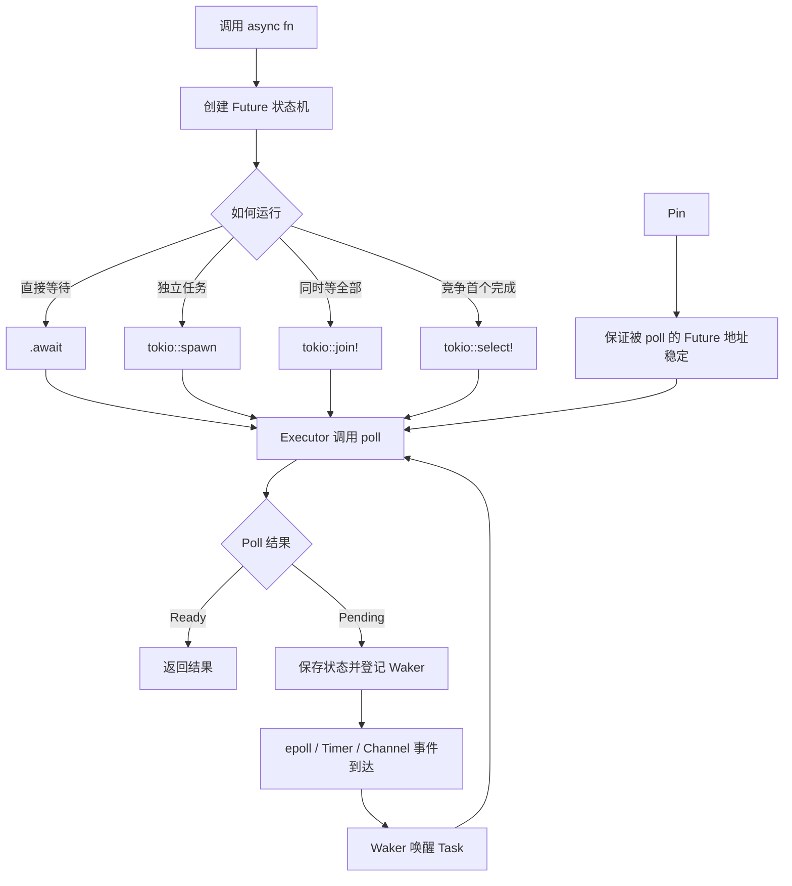

# Tokio 中的 `async`、`.await` 与 `Pin`

> 面向已经掌握 Rust 基础、正在学习服务端异步编程的读者。  
> 本文重点不是罗列语法，而是建立下面这条完整认知链：

```text
async 代码
    ↓ 编译器转换
Future 状态机
    ↓ Tokio Executor 调用 poll
Poll::Ready / Poll::Pending
    ↓ Pending 时登记 Waker
epoll / 定时器 / Channel 等事件到达
    ↓ Waker 唤醒
Task 重新进入 Runnable Queue
    ↓ 再次 poll
从上次 .await 的位置继续执行
```

---

## 1. 先区分：哪些属于 Rust，哪些属于 Tokio

很多初学者会把 `async`、`.await` 和 Tokio 混在一起，实际上它们属于不同层次。

| 能力 | 所属层次 | 作用 |
|---|---|---|
| `async fn`、`async {}`、`.await` | Rust 语言 | 把异步逻辑编译成 `Future` 状态机 |
| `Future`、`Poll`、`Waker`、`Pin` | Rust 标准库 | 定义异步任务如何被推进 |
| Executor、Task 调度 | Tokio Runtime | 不断调用 Future 的 `poll` |
| TCP、UDP、文件、定时器、Channel | Tokio | 提供可以与 Runtime 协作的异步资源 |
| `spawn`、`join!`、`select!` | Tokio | 组织多个异步操作的并发关系 |

可以把它和 C++ 网络编程做一个类比：

```text
Rust async/await          ≈ C++20 coroutine 语法与协程状态机
Future::poll              ≈ 协程恢复执行 / resume
Tokio Runtime             ≈ Reactor + 任务调度器 + 线程池
Tokio I/O Driver          ≈ epoll 事件循环
Waker                      ≈ 事件就绪后将协程重新放入就绪队列
Pin                        ≈ 保证协程帧中的对象地址稳定
```

需要特别注意：

> Tokio 并没有发明 `async/await`，它负责运行由 Rust 编译器生成的 Future。

---

# 2. `async`：把一段逻辑变成 Future

## 2.1 `async fn` 不会立即执行函数体

普通函数调用会立即执行：

```rust
fn add(a: i32, b: i32) -> i32 {
    a + b
}

let result = add(1, 2);
```

异步函数调用只会创建一个 Future：

```rust
async fn add(a: i32, b: i32) -> i32 {
    a + b
}

let future = add(1, 2);
```

此时 `add` 的函数体还没有真正运行。概念上可以理解为：

```rust
fn add(a: i32, b: i32) -> impl Future<Output = i32> {
    async move { a + b }
}
```

只有当 Future 被以下方式之一驱动时，它才会开始执行：

```rust
let result = add(1, 2).await;
```

或者：

```rust
let handle = tokio::spawn(add(1, 2));
let result = handle.await?;
```

或者被 Runtime 的 `block_on` 驱动：

```rust
let runtime = tokio::runtime::Runtime::new()?;
let result = runtime.block_on(add(1, 2));
```

因此，Future 具有明显的**惰性执行**特征：

```rust
async fn work() {
    println!("work started");
}

#[tokio::main]
async fn main() {
    let future = work();

    println!("future created");

    future.await;
}
```

输出顺序是：

```text
future created
work started
```

---

## 2.2 `async` 的三种常见形式

### 形式一：`async fn`

最常见，适合定义可复用异步函数。

```rust
async fn fetch_user(user_id: u64) -> Result<String, std::io::Error> {
    Ok(format!("user-{user_id}"))
}
```

返回类型虽然写成：

```rust
Result<String, std::io::Error>
```

但函数调用实际返回的是：

```rust
impl Future<Output = Result<String, std::io::Error>>
```

---

### 形式二：`async {}`

适合临时创建一个 Future。

```rust
let future = async {
    let value = 10;
    value * 2
};

let result = future.await;
assert_eq!(result, 20);
```

它与 C++ 中临时创建一个协程任务、Lambda 或可调用对象比较相似。

---

### 形式三：`async move {}`

`move` 表示把外部变量的所有权移动进 Future。

```rust
let message = String::from("hello");

let future = async move {
    println!("{message}");
};

future.await;
```

在 `tokio::spawn` 中非常常见：

```rust
let message = String::from("hello");

tokio::spawn(async move {
    println!("{message}");
});
```

原因是被 `spawn` 出去的 Task 可能比当前函数活得更久，所以不能随意借用当前栈帧中的局部变量。

---

# 3. `.await`：暂停的是 Task，不是线程

## 3.1 `.await` 到底做了什么

```rust
let data = socket.read(&mut buf).await?;
```

这行代码大致表达：

1. 尝试推进 `read` 对应的 Future；
2. 如果数据已经可读，返回结果；
3. 如果暂时不可读，返回 `Poll::Pending`；
4. 当前 Task 让出执行权；
5. Tokio 线程继续运行其他 Task；
6. socket 可读后，I/O Driver 通过 Waker 唤醒该 Task；
7. Task 再次被调度，并从这个 `.await` 附近继续运行。

简化状态图：



`.await` 并不等同于操作系统线程阻塞：

```text
阻塞 I/O：
线程调用 read
    ↓
线程睡眠
    ↓
该线程暂时不能执行其他连接

异步 I/O：
Task 调用 read().await
    ↓
Task 返回 Pending
    ↓
工作线程继续执行其他 Task
```

这正是 Tokio 能用少量线程处理大量连接的核心原因。

---

## 3.2 `.await` 只能出现在异步上下文中

下面代码无法编译：

```rust
fn main() {
    tokio::time::sleep(std::time::Duration::from_secs(1)).await;
}
```

因为普通函数不是 Future 状态机，没有地方保存暂停时的执行状态。

通常使用：

```rust
#[tokio::main]
async fn main() {
    tokio::time::sleep(std::time::Duration::from_secs(1)).await;
}
```

`#[tokio::main]` 可以近似理解为替你生成了：

```rust
fn main() {
    let runtime = tokio::runtime::Runtime::new().unwrap();

    runtime.block_on(async {
        tokio::time::sleep(std::time::Duration::from_secs(1)).await;
    });
}
```

它负责：

- 创建 Tokio Runtime；
- 创建工作线程和调度器；
- 启动 I/O Driver 与 Timer Driver；
- 驱动 `async main` 对应的 Future。

---

## 3.3 `.await` 前后的局部变量会进入 Future 状态机

```rust
async fn process() {
    let data = String::from("request");

    tokio::time::sleep(std::time::Duration::from_secs(1)).await;

    println!("{data}");
}
```

由于 `data` 在 `.await` 之后仍然需要使用，因此它不能只存在于普通函数栈帧中。

编译器会把它存进 Future 状态机：

```text
ProcessFuture {
    state: WaitingForTimer,
    data: String,
    timer: Sleep,
}
```

这也是理解 `Pin` 的重要前提：

> Future 不只是一个“将来的结果”，它还保存了异步函数暂停时的局部变量和执行状态。

---

# 4. `async` 不等于并发

下面代码虽然使用了两个 `.await`，但执行顺序仍然是串行的：

```rust
async fn task_a() {
    tokio::time::sleep(std::time::Duration::from_secs(1)).await;
}

async fn task_b() {
    tokio::time::sleep(std::time::Duration::from_secs(1)).await;
}

#[tokio::main]
async fn main() {
    task_a().await;
    task_b().await;
}
```

执行流程：

```text
等待 task_a 完成
    ↓
再启动并等待 task_b
```

总耗时大约为两秒。

异步表示“可以暂停”，并发表示“多个任务的执行时间发生重叠”。二者不是同一个概念。

---

## 4.1 `tokio::join!`：同一个 Task 内并发等待

```rust
use std::time::Duration;

async fn task_a() -> &'static str {
    tokio::time::sleep(Duration::from_secs(1)).await;
    "A"
}

async fn task_b() -> &'static str {
    tokio::time::sleep(Duration::from_secs(1)).await;
    "B"
}

#[tokio::main]
async fn main() {
    let (a, b) = tokio::join!(task_a(), task_b());

    println!("{a}, {b}");
}
```

`join!` 会在当前 Task 中交替 poll 多个 Future，直到全部完成。

特点：

- 不会为每个分支创建独立 Tokio Task；
- 多个 Future 在同一个 Task 中被复用；
- 默认不会因为其中一个普通 `Result::Err` 而提前退出；
- 对 `Result` 场景可使用 `tokio::try_join!`。

```text
当前 Task
├── poll Future A
├── poll Future B
├── Future A Pending
├── Future B Pending
└── 等待任一 Waker 唤醒当前 Task
```

这属于并发，但不意味着 CPU 并行。

---

## 4.2 `tokio::spawn`：创建独立 Task

```rust
#[tokio::main]
async fn main() -> Result<(), tokio::task::JoinError> {
    let handle_a = tokio::spawn(async {
        10
    });

    let handle_b = tokio::spawn(async {
        20
    });

    let a = handle_a.await?;
    let b = handle_b.await?;

    println!("{}", a + b);
    Ok(())
}
```

每次 `tokio::spawn` 都会创建一个独立 Task，并返回 `JoinHandle<T>`。

```text
Tokio Runtime
├── Task A
│   └── Future A
└── Task B
    └── Future B
```

在多线程 Runtime 中，两个 Task 可能：

- 在同一个工作线程上交替执行；
- 被窃取到不同工作线程；
- 在不同时间运行；
- 在某一时刻真正并行运行。

这与 C++ 线程池中的任务队列比较相似，但 Tokio Task 更轻量，并且能在 `.await` 时主动让出工作线程。

---

## 4.3 `tokio::select!`：谁先完成就处理谁

```rust
use std::time::Duration;
use tokio::time;

#[tokio::main]
async fn main() {
    tokio::select! {
        _ = time::sleep(Duration::from_secs(1)) => {
            println!("timer A completed");
        }
        _ = time::sleep(Duration::from_secs(3)) => {
            println!("timer B completed");
        }
    }
}
```

大约一秒后，第一个分支完成，`select!` 返回。其他未完成分支通常会被丢弃。

适用场景：

- 请求超时；
- 等待关闭信号；
- 同时监听多个 Channel；
- 同时处理 socket 输入和退出命令；
- 主任务与后台任务竞争完成。

例如，一个服务端连接同时等待客户端数据与服务器关闭信号：

```rust
use tokio::io::{AsyncReadExt, AsyncWriteExt};
use tokio::net::TcpStream;
use tokio::sync::broadcast;

async fn handle_connection(
    mut stream: TcpStream,
    mut shutdown_rx: broadcast::Receiver<()>,
) -> std::io::Result<()> {
    let mut buf = [0_u8; 1024];

    loop {
        tokio::select! {
            result = stream.read(&mut buf) => {
                let n = result?;

                if n == 0 {
                    break;
                }

                stream.write_all(&buf[..n]).await?;
            }

            _ = shutdown_rx.recv() => {
                println!("connection received shutdown signal");
                break;
            }
        }
    }

    Ok(())
}
```

注意：

> `select!` 未选中的 Future 会发生取消或丢弃，因此真实项目中需要确认相关异步操作是否具备 cancellation safety（取消安全性）。

---

# 5. `Future` 的本质：可被反复推进的状态机

Rust 标准库中的 `Future` 核心接口是：

```rust
pub trait Future {
    type Output;

    fn poll(
        self: std::pin::Pin<&mut Self>,
        cx: &mut std::task::Context<'_>,
    ) -> std::task::Poll<Self::Output>;
}
```

`poll` 只有两类结果：

```rust
enum Poll<T> {
    Ready(T),
    Pending,
}
```

可以把一个异步函数：

```rust
async fn example() -> i32 {
    let a = step_one().await;
    let b = step_two(a).await;
    b + 1
}
```

理解成编译器生成的状态机：

```rust
enum ExampleState {
    Start,
    WaitingStepOne {
        future: StepOneFuture,
    },
    WaitingStepTwo {
        a: i32,
        future: StepTwoFuture,
    },
    Completed,
}
```

每次 Executor 调用 `poll`：

```text
Start
  ↓ poll step_one
Pending
  ↓ 事件完成并唤醒
WaitingStepOne
  ↓ 得到 a，开始 poll step_two
Pending
  ↓ 事件完成并唤醒
WaitingStepTwo
  ↓ 得到 b
Ready(b + 1)
```

伪代码如下：

```rust
match self.state {
    Start => {
        // 创建 step_one Future
        // poll 它
    }

    WaitingStepOne => {
        // 再次 poll step_one
        // Ready 后保存结果并进入下一状态
    }

    WaitingStepTwo => {
        // 再次 poll step_two
    }

    Completed => {
        panic!("polled after completion");
    }
}
```

---

# 6. 为什么 `Future::poll` 需要 `Pin`

这是本文最关键、也最容易困惑的部分。

`Future::poll` 的第一个参数不是普通的：

```rust
&mut Self
```

而是：

```rust
Pin<&mut Self>
```

原因是 Future 在开始执行后，内部某些数据的地址必须保持稳定。

---

## 6.1 移动一个 Rust 值，地址可能发生变化

```rust
let value = String::from("hello");
let another = value;
```

这里发生所有权移动。Rust 语义上不保证 `value` 与 `another` 位于相同内存地址。

普通对象通常不在意，因为其内部不存在指向自身字段的引用。

但是 Future 状态机可能包含类似关系：

```text
Future {
    buffer: String,
    operation: 某个借用了 buffer 的异步操作
}
```

概念上可能形成：

```text
operation ───────► buffer
     两者都存放在同一个 Future 对象中
```

如果 Future 在第一次 `poll` 后被移动：

```text
移动前：
0x1000 Future
├── buffer      0x1010
└── operation ───────► 0x1010

移动后：
0x2000 Future
├── buffer      0x2010
└── operation ───────► 0x1010  // 旧地址，可能失效
```

这类对象可以称为具有“自引用”特征的对象。

因此，在开始 poll 某些 Future 之后，必须保证其底层值不再移动。

---

## 6.2 `Pin` 的核心语义

`Pin<P>` 表示：

> 通过这个被固定的指针，不能再安全地把底层值移动到其他地址。

例如：

```rust
Pin<&mut T>
Pin<Box<T>>
```

需要准确理解：

- `Pin` 不是新的智能指针；
- `Pin` 不负责内存分配；
- `Pin` 不负责引用计数；
- `Pin` 不一定意味着对象在堆上；
- `Pin` 固定的是**指针指向的值**；
- `Pin<Box<T>>` 本身仍然可以移动，但 Box 指向的 `T` 地址保持稳定。

C++ 类比：

```text
Pin<Box<T>>
```

比较接近：

```cpp
std::unique_ptr<T>
```

自身可以移动，但堆上的 `T` 不随 `unique_ptr` 的移动而搬家。

不过 Rust 的 `Pin` 还在类型系统中限制了“把底层 T move 出去”的能力。

---

# 7. `Unpin`：允许被固定后仍然移动的类型

`Unpin` 是一个自动 Trait。

```rust
pub auto trait Unpin {}
```

绝大多数普通 Rust 类型都实现了 `Unpin`：

```rust
i32
String
Vec<T>
Box<T>
普通结构体
```

对于 `T: Unpin`：

```rust
Pin<&mut T>
```

不会施加实质限制，因为这种类型本来就不依赖固定地址。

例如：

```rust
use std::pin::Pin;

let mut value = 10;
let pinned = Pin::new(&mut value);
```

`i32: Unpin`，所以可以安全构造。

而编译器生成的 async Future 通常不能假定为 `Unpin`。它们需要在 poll 前固定。

可以记住：

```text
Unpin：
移动对象是安全的，不依赖固定地址

!Unpin：
对象一旦进入 pinned 状态，就不能再移动底层值
```

注意：

> `!Unpin` 不表示对象创建后立刻不能移动，而是表示对象一旦被 Pin，就必须遵守地址稳定约束。

---

# 8. Tokio 中常见的 Pin 用法

日常业务代码中，通常不需要手动实现 `Future::poll`，也不需要直接操作复杂的 Pin API。

最常见的 Pin 使用场景主要有三个。

---

## 8.1 直接 `.await`：通常不需要显式 Pin

```rust
async fn request() -> i32 {
    42
}

#[tokio::main]
async fn main() {
    let result = request().await;
    println!("{result}");
}
```

`.await` 的展开逻辑会处理 Future 的固定与 poll，用户一般不用关心。

因此：

> 仅仅调用异步函数并 `.await` 时，通常不需要写 `Pin`。

---

## 8.2 `Box::pin`：把 Future 固定在堆上

```rust
use std::future::Future;
use std::pin::Pin;

fn create_future() -> Pin<Box<dyn Future<Output = i32> + Send>> {
    Box::pin(async {
        42
    })
}
```

这里：

```rust
Box::pin(async { 42 })
```

完成两件事：

1. 把 Future 分配到堆上；
2. 返回 `Pin<Box<FutureType>>`，保证堆上的 Future 地址稳定。

常见用途：

- 返回动态分发的 Future；
- 把不同具体类型的 Future 放入同一容器；
- 长期保存 Future；
- 需要在多个 `select!` 调用中复用同一个 Future；
- 某些 Trait 接口要求返回 boxed future。

例如，不同 `async` 块具有不同匿名类型，不能直接放进同一个 `Vec`：

```rust
use std::future::Future;
use std::pin::Pin;

type BoxFuture =
    Pin<Box<dyn Future<Output = i32> + Send>>;

let futures: Vec<BoxFuture> = vec![
    Box::pin(async { 10 }),
    Box::pin(async { 20 }),
];
```

---

## 8.3 `tokio::pin!`：在当前作用域进行局部 Pin

```rust
use std::time::Duration;
use tokio::time;

#[tokio::main]
async fn main() {
    let timer = time::sleep(Duration::from_secs(5));

    tokio::pin!(timer);

    tokio::select! {
        _ = &mut timer => {
            println!("timer completed");
        }
        _ = time::sleep(Duration::from_secs(1)) => {
            println!("another event completed first");
        }
    }
}
```

`tokio::time::Sleep` 不能被简单地作为普通 `&mut Sleep` 在需要稳定地址的场景中反复 poll。`tokio::pin!` 将它固定在当前局部存储中。

可以概念性理解为：

```text
let timer = SleepFuture;
tokio::pin!(timer);

timer 的底层存储位置在当前作用域内保持稳定
```

这种方式不会强制进行堆分配，适合短生命周期局部 Future。

现代 Rust 标准库也提供：

```rust
std::pin::pin!
```

二者的核心目的相似：把局部值固定起来。

---

# 9. 为什么 `select!` 中经常出现 `&mut future`

考虑下面的重试与超时逻辑：

```rust
use std::time::Duration;
use tokio::time;

#[tokio::main]
async fn main() {
    let timeout = time::sleep(Duration::from_secs(5));
    tokio::pin!(timeout);

    loop {
        tokio::select! {
            _ = &mut timeout => {
                println!("overall timeout");
                break;
            }

            _ = do_one_attempt() => {
                println!("one attempt completed");
            }
        }
    }
}

async fn do_one_attempt() {
    time::sleep(Duration::from_secs(1)).await;
}
```

这里不能每次循环都重新写：

```rust
time::sleep(Duration::from_secs(5))
```

否则每轮循环都会创建一个新的五秒定时器，无法表达“整个操作最多五秒”。

所以需要：

1. 在循环外创建一次 Future；
2. Pin 住它；
3. 每轮把 `&mut timeout` 交给 `select!` 继续 poll。

```text
同一个 timeout Future
    ↓ 第一次 select!：poll，Pending
保存剩余状态
    ↓ 第二次 select!：继续 poll
保存剩余状态
    ↓ 最终 Ready
```

这就是 Pin 在 Tokio 业务代码中最典型的实际用法之一。

---

# 10. 一个完整的 Tokio TCP Echo Server

下面把 `async`、`.await`、`spawn` 和 Tokio Runtime 串起来。

## 10.1 `Cargo.toml`

```toml
[package]
name = "tokio-echo-server"
version = "0.1.0"
edition = "2024"

[dependencies]
tokio = { version = "1", features = ["full"] }
```

## 10.2 服务端代码

```rust
use tokio::io::{AsyncReadExt, AsyncWriteExt};
use tokio::net::{TcpListener, TcpStream};

#[tokio::main]
async fn main() -> std::io::Result<()> {
    let listener = TcpListener::bind("127.0.0.1:8080").await?;

    println!("listening on 127.0.0.1:8080");

    loop {
        let (stream, peer_addr) = listener.accept().await?;

        println!("accepted connection from {peer_addr}");

        tokio::spawn(async move {
            if let Err(error) = handle_connection(stream).await {
                eprintln!("connection error: {error}");
            }
        });
    }
}

async fn handle_connection(
    mut stream: TcpStream,
) -> std::io::Result<()> {
    let mut buffer = [0_u8; 4096];

    loop {
        let read_size = stream.read(&mut buffer).await?;

        if read_size == 0 {
            break;
        }

        stream.write_all(&buffer[..read_size]).await?;
    }

    Ok(())
}
```

---

## 10.3 从 epoll/Reactor 角度理解

### `listener.accept().await`

```text
1. Task 调用 accept Future
2. 尝试 accept
3. 当前没有连接
4. Future 返回 Pending
5. Tokio 将 listener fd 注册到 I/O Driver
6. 当前 Task 让出线程
7. epoll_wait 发现 listener 可读
8. I/O Driver 唤醒 Task
9. Task 再次 poll accept Future
10. accept 成功，返回 TcpStream
```

### `tokio::spawn`

每个连接被封装成一个独立 Task：

```text
Acceptor Task
├── accept connection A
│   └── spawn Connection Task A
├── accept connection B
│   └── spawn Connection Task B
└── accept connection C
    └── spawn Connection Task C
```

这类似经典 C++ Reactor：

```text
epoll thread
    ↓
连接事件
    ↓
创建 Connection 对象
    ↓
注册读写回调
```

区别在于 Tokio 将回调链隐藏在 Future 状态机和 `.await` 后面，使代码看起来接近同步流程。

### `stream.read(...).await`

当连接暂时没有数据时：

```text
Connection Task A → Pending
Connection Task B → 可运行
Connection Task C → 可运行
```

工作线程不会因为 A 没有数据而停住。

---

# 11. `tokio::spawn` 的 `Send + 'static` 要求

多线程 Tokio Runtime 中，`tokio::spawn` 通常要求：

```rust
Future + Send + 'static
```

## 11.1 为什么要求 `Send`

Task 可能在不同工作线程之间迁移：

```text
第一次 poll：Worker Thread 1
       ↓ Pending
第二次 poll：Worker Thread 3
```

因此，跨 `.await` 保存进 Future 状态机中的数据，也必须允许在线程间移动。

下面代码会遇到问题：

```rust
use std::rc::Rc;

#[tokio::main]
async fn main() {
    let value = Rc::new(10);

    tokio::spawn(async move {
        tokio::task::yield_now().await;
        println!("{value}");
    });
}
```

`Rc<T>` 不是 `Send`，不能安全迁移到其他线程。

通常使用：

```rust
use std::sync::Arc;

let value = Arc::new(10);

tokio::spawn(async move {
    tokio::task::yield_now().await;
    println!("{value}");
});
```

对于确实不需要跨线程的 `!Send` Future，可以研究：

```rust
tokio::task::LocalSet
tokio::task::spawn_local
```

---

## 11.2 为什么要求 `'static`

`'static` 并不是要求 Task 永远存在，而是要求：

> Task 不能持有可能提前失效的非 `'static` 借用。

错误思路：

```rust
async fn run() {
    let message = String::from("hello");

    tokio::spawn(async {
        println!("{message}");
    });
}
```

Task 可能在 `run` 返回之后才执行，但它借用了 `run` 栈帧中的 `message`。

改成移动所有权：

```rust
async fn run() {
    let message = String::from("hello");

    tokio::spawn(async move {
        println!("{message}");
    });
}
```

Future 拥有 `message`，不再依赖外部栈帧。

---

# 12. 不要在异步 Task 中执行长时间阻塞操作

下面代码虽然处于 async 函数中，但 `std::thread::sleep` 会阻塞工作线程：

```rust
async fn bad_task() {
    std::thread::sleep(std::time::Duration::from_secs(5));
}
```

这五秒内，该 Tokio Worker Thread 无法调度其他 Task。

应使用 Tokio 异步定时器：

```rust
async fn good_task() {
    tokio::time::sleep(
        std::time::Duration::from_secs(5),
    )
    .await;
}
```

对于 CPU 密集或阻塞式第三方库：

```rust
async fn calculate() -> Result<u64, tokio::task::JoinError> {
    tokio::task::spawn_blocking(|| {
        expensive_cpu_calculation()
    })
    .await
}

fn expensive_cpu_calculation() -> u64 {
    42
}
```

`spawn_blocking` 会把阻塞任务交给专门的阻塞线程池，避免长时间占用异步工作线程。

C++ 类比：

```text
Tokio Worker Thread
    ≈ Reactor / coroutine scheduler thread

spawn_blocking thread pool
    ≈ 专门执行阻塞任务或 CPU 任务的业务线程池
```

---

# 13. `.await` 跨越锁作用域的风险

下面写法很危险：

```rust
use std::sync::{Arc, Mutex};

async fn bad(
    state: Arc<Mutex<Vec<i32>>>,
) {
    let mut guard = state.lock().unwrap();

    guard.push(1);

    do_async_io().await;

    guard.push(2);
}

async fn do_async_io() {}
```

问题是锁可能跨越 `.await`：

```text
Task A 获取 Mutex
    ↓
Task A 在 await 处 Pending
    ↓
工作线程运行 Task B
    ↓
Task B 也需要该 Mutex
    ↓
阻塞或形成复杂竞争
```

更好的写法是缩短同步锁作用域：

```rust
async fn good(
    state: Arc<Mutex<Vec<i32>>>,
) {
    {
        let mut guard = state.lock().unwrap();
        guard.push(1);
    }

    do_async_io().await;

    {
        let mut guard = state.lock().unwrap();
        guard.push(2);
    }
}
```

一般原则：

```text
同步 Mutex：
用于很短、不会 await 的临界区

tokio::sync::Mutex：
用于确实必须跨 await 持有锁的异步资源
```

但即使使用 `tokio::sync::Mutex`，也应尽量缩小锁范围。

---

# 14. Pin 的常见误区

## 误区一：所有异步代码都必须手动 Pin

错误。

普通 `.await` 场景由编译器和 Runtime 处理：

```rust
operation().await;
```

只有在以下场景中较常显式使用 Pin：

- 保存 Future；
- 反复 poll 同一个 Future；
- `select!` 循环；
- 动态分发 Future；
- 编写底层 Future、Stream 或异步框架；
- 处理 `!Unpin` 类型。

---

## 误区二：Pin 就是把对象放到堆上

错误。

```rust
Box::pin(value)
```

确实进行堆分配，但：

```rust
tokio::pin!(value)
std::pin::pin!(value)
```

可以在局部存储中固定值。

更准确的概念是：

```text
Box：决定存储位置和所有权
Pin：约束底层值不能再被安全移动
```

---

## 误区三：`Pin<Box<T>>` 完全不能移动

错误。

可以移动 `Pin<Box<T>>` 这个指针包装对象：

```rust
let pinned_a = Box::pin(value);
let pinned_b = pinned_a;
```

底层堆对象 `T` 的地址没有变化。

```text
移动的是 Box 指针
不是 Box 指向的 T
```

---

## 误区四：`!Unpin` 的值从创建开始就不能移动

错误。

在被 Pin 之前，它仍然可以移动：

```text
创建 !Unpin 值
    ↓ 可以移动
将其放入 Pin<Box<T>>
    ↓ 从此底层 T 必须保持地址稳定
```

---

## 误区五：`.await` 会阻塞当前线程

错误。

正确描述是：

> 当被等待的 Future 返回 `Pending` 时，当前 Task 暂停并让出执行权。

但是，如果 `.await` 之前执行的是 CPU 密集循环或阻塞系统调用，线程仍然会被占住。

---

## 误区六：async 函数天然并行

错误。

```rust
a().await;
b().await;
```

仍然是串行。

需要明确使用：

```rust
tokio::join!(a(), b());
```

或者：

```rust
tokio::spawn(a());
tokio::spawn(b());
```

---

# 15. 工程中的选择规则

## 15.1 什么时候直接 `.await`

当前操作依赖前一步结果时：

```rust
let user = load_user().await?;
let orders = load_orders(user.id).await?;
```

这是明确的串行依赖。

---

## 15.2 什么时候使用 `join!`

多个操作彼此独立，并且希望全部完成：

```rust
let (user, config, permissions) = tokio::try_join!(
    load_user(),
    load_config(),
    load_permissions(),
)?;
```

适合：

- 同时请求多个下游服务；
- 同时读取多个缓存或数据库；
- 不需要独立任务生命周期；
- 分支数量固定且较少。

---

## 15.3 什么时候使用 `spawn`

任务需要独立调度或独立生命周期：

```rust
tokio::spawn(async move {
    handle_connection(stream).await
});
```

适合：

- 每个 TCP 连接一个 Task；
- 后台日志上传；
- 消费消息队列；
- 独立心跳任务；
- 并发处理大量请求。

必须注意：

- 限制并发数量；
- 处理 `JoinHandle`；
- 管理 Task 关闭；
- 避免无限制 `spawn`；
- 明确错误传播方式。

---

## 15.4 什么时候使用 `select!`

只关心第一个完成的事件，或者需要同时监听控制信号：

```rust
tokio::select! {
    result = request() => {
        handle_result(result);
    }

    _ = shutdown_signal() => {
        graceful_shutdown().await;
    }
}
```

典型场景：

- 请求与超时；
- socket 与关闭信号；
- 多个 Channel；
- 主任务和心跳故障；
- 首个可用副本响应。

---

## 15.5 什么时候显式 Pin

看到以下需求时再考虑：

```text
我要保存这个 Future
我要重复 select 同一个 Future
我要把多个不同 Future 类型放进容器
我要返回 dyn Future
我要手写 poll
编译器提示类型不能 Unpin
```

常用选择：

```text
短生命周期局部 Future
    → tokio::pin! / std::pin::pin!

需要所有权、堆存储或动态分发
    → Box::pin

普通一次性 await
    → 不显式 Pin
```

---

# 16. `async/await` 与 C++ 网络编程的整体对比

| Rust / Tokio | C++ 常见实现 |
|---|---|
| `async fn` | C++20 coroutine function |
| Future 状态机 | coroutine frame |
| `.await` | `co_await` |
| Executor `poll` Future | coroutine scheduler 恢复协程 |
| `Waker` | 将 coroutine handle 放回 runnable queue |
| Tokio I/O Driver | epoll Reactor |
| `tokio::spawn` | 在线程池/协程调度器提交任务 |
| `tokio::select!` | 等待多个异步事件，处理先完成者 |
| `Pin` | 保证 coroutine frame / 自引用对象地址稳定 |
| `spawn_blocking` | 阻塞业务线程池 |
| `JoinHandle` | task handle / future handle |

传统 C++ Reactor 代码常见形态：

```cpp
socket.on_readable([connection] {
    connection->read();

    database.async_query([connection](Result result) {
        connection->write(result);
    });
});
```

随着异步步骤增加，容易形成回调嵌套：

```text
read callback
    ↓
parse callback
    ↓
database callback
    ↓
rpc callback
    ↓
write callback
```

Tokio 中可以写成：

```rust
async fn handle_request(
    mut stream: TcpStream,
) -> Result<(), AppError> {
    let request = read_request(&mut stream).await?;
    let user = query_database(&request).await?;
    let result = call_downstream(user).await?;
    write_response(&mut stream, result).await?;

    Ok(())
}
```

表面是串行代码，底层仍然是状态机：

```text
ReadRequest
    ↓ Pending
QueryDatabase
    ↓ Pending
CallDownstream
    ↓ Pending
WriteResponse
    ↓ Ready
```

因此可以把 Tokio 理解为：

> 使用编译器生成的 Future 状态机，替代人工维护的回调状态机；使用 Runtime 和 I/O Driver，替代手写 epoll 事件循环与任务调度框架。

---

# 17. 最佳实践速查

## 语法层面

1. 异步函数使用 `async fn`，调用后必须 `.await`、`spawn` 或交给 Runtime 驱动。
2. 需要把外部变量交给独立 Task 时，优先使用 `async move`。
3. 不要把“使用 async”误认为“自动并发”。
4. 有串行依赖时直接 `.await`。
5. 独立操作同时完成使用 `join!` / `try_join!`。
6. 独立生命周期任务使用 `spawn`。
7. 首个事件竞争使用 `select!`。

## 调度层面

1. `.await` 应对应真正可暂停的异步操作。
2. 不在 Runtime Worker Thread 中长时间阻塞。
3. CPU 密集和阻塞任务使用 `spawn_blocking` 或专用线程池。
4. 长循环需要自然 `.await` 点，必要时使用 `yield_now().await`。
5. 不无限制创建 Task、连接或 Channel 消息。
6. 为并发量、队列长度和连接数量设置上限。

## 所有权与线程安全

1. `tokio::spawn` 中常用 `async move`。
2. 多线程 Runtime 中跨 `.await` 的数据通常需要 `Send`。
3. 共享所有权通常使用 `Arc<T>`，而不是 `Rc<T>`。
4. 不要让非必要的锁 guard 跨越 `.await`。
5. 不要把借用当前栈帧的数据交给可能长期存在的 Task。

## Pin

1. 普通 `.await` 不需要手写 Pin。
2. `Pin` 的核心是保证底层值地址稳定，而不是堆分配。
3. 局部固定优先 `tokio::pin!` 或 `std::pin::pin!`。
4. 需要所有权或动态分发时使用 `Box::pin`。
5. `Pin<Box<T>>` 可以移动指针包装，但不能安全移动底层 `T`。
6. 不要为了“看起来高级”而手动实现 Pin 或 Future。
7. 只有编写底层异步抽象时，才深入接触 `unsafe` Pin 投影。

---

# 18. 一张图总结



---

# 19. 最终理解

可以用一句话分别概括：

### `async`

```text
把普通控制流程编译成一个保存执行状态的 Future 状态机。
```

### `.await`

```text
尝试推进一个 Future；未完成时暂停当前 Task，并把线程让给其他 Task。
```

### Tokio Runtime

```text
负责调度 Task、调用 Future::poll，并把 epoll、定时器和 Channel 事件转换为 Waker 唤醒。
```

### `Pin`

```text
保证 Future 在被 poll 后，其底层存储地址保持稳定，从而使状态机内部引用始终有效。
```

### `Unpin`

```text
表示该类型即使移动也不会破坏其内部有效性，因此 Pin 对它没有实质限制。
```

从 C++ 服务端视角看，Tokio 最重要的价值是：

```text
过去：
epoll + 回调 + Connection 状态 + 人工事件循环

现在：
async/await + Future 状态机 + Tokio Runtime
```

代码从“事件发生后调用哪个回调”，转变为“业务下一步要做什么”，但底层仍然是 Reactor、就绪事件、任务队列与状态机。

---

# 参考资料

- [Rust 标准库：`std::future::Future`](https://doc.rust-lang.org/std/future/trait.Future.html)
- [Rust 标准库：`std::pin`](https://doc.rust-lang.org/std/pin/)
- [Rust Reference：Await expressions](https://doc.rust-lang.org/reference/expressions/await-expr.html)
- [Rust 关键字：`async`](https://doc.rust-lang.org/std/keyword.async.html)
- [Tokio Tutorial：Async in depth](https://tokio.rs/tokio/tutorial/async)
- [Tokio Tutorial：Spawning](https://tokio.rs/tokio/tutorial/spawning)
- [Tokio Tutorial：Select](https://tokio.rs/tokio/tutorial/select)
- [Tokio API：`tokio::select!`](https://docs.rs/tokio/latest/tokio/macro.select.html)
- [Tokio API：`tokio::join!`](https://docs.rs/tokio/latest/tokio/macro.join.html)
